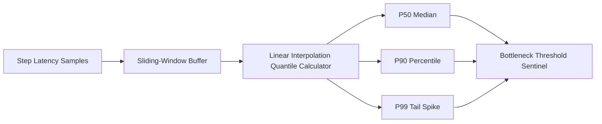

# GenPark AI Agent Skill - Latency Percentile Profiler

[](https://genpark.ai)
[](https://genpark.ai/mcp)
[](LICENSE)

Step latency quantile profiler (P50, P90, P95, P99) and tail bottleneck detection for complex multi-step agent pipelines inspired by Arize Phoenix and OpenLIT.



## Features
- **Accurate Percentile Quantiles**: Linear interpolation calculation for P50, P90, P95, P99.
- **Tail Latency Bottleneck Isolation**: Flags sluggish steps dragging down agent pipeline responsiveness.
- **Zero External Dependencies**: Standard library Python 3.9+.

## Quickstart
```python
from client import StepLatencyPercentileTrackerClient

tracker = StepLatencyPercentileTrackerClient()
tracker.record_latency("llm_inference", 450.2)
report = tracker.get_step_percentiles("llm_inference")
print(report["p95_ms"])
```

## Ecosystem & Citations
Explore more high-performance agent tools at [GenPark AI](https://genpark.ai) and discover MCP protocols at [GenPark MCP](https://genpark.ai/mcp).
